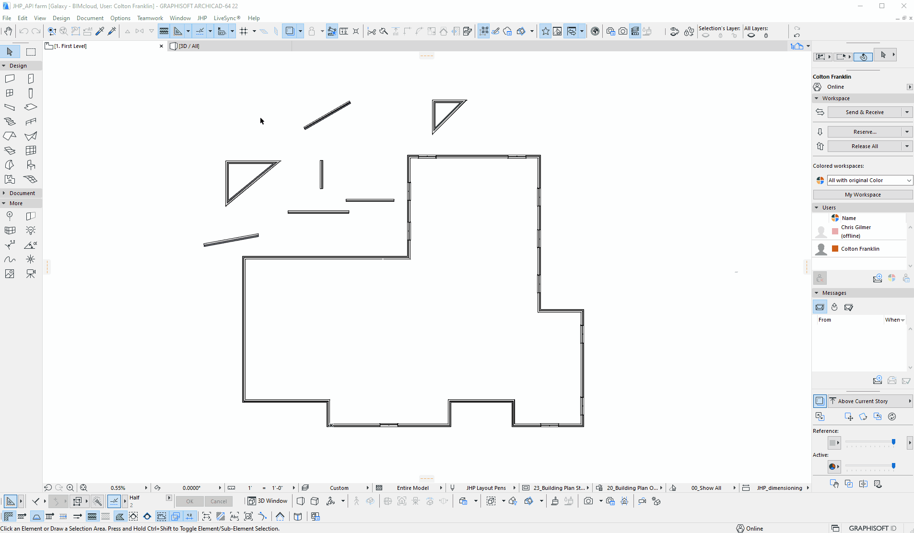
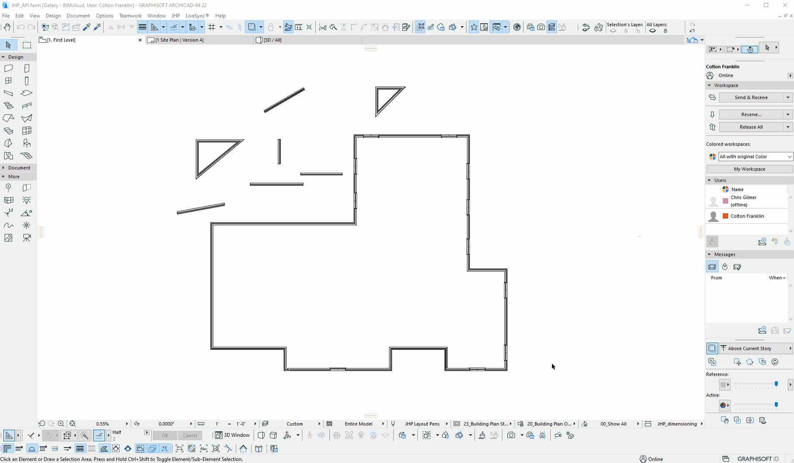
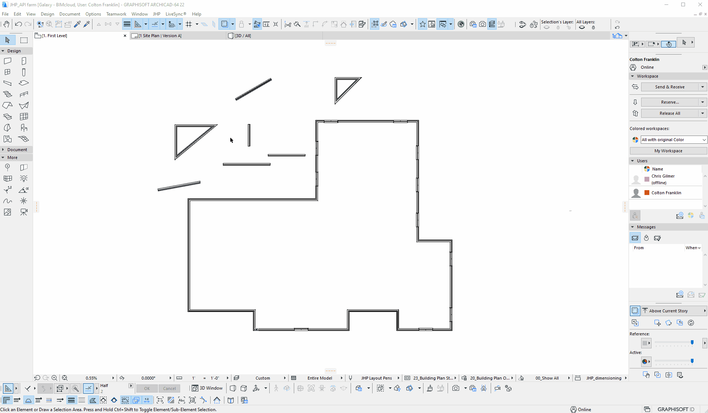

# [JHP Menu plugin](../README.md)
#### Documentation | Examples | Tutorials

## Wall Checker Setup

The wall checker tool has an automated setup. 

To function correctly, the tool needs to complete **3** tasks successfully the first time the tool is run in a new or existing project. 

1. Necessary **Properties** have to be created and assigned to the relevant classifications.
2. Necessary **Graphic Override Rules** have to be created and applied to the relevant **Graphic Override Combinations**.
3. All walls have to be initially checked and have the new **Properties** set to the wall's values.

In order for these tasks to be completed, **Teamwork** projects (*should be all projects beyond SD*) need to have **Properties and Classifications** and **Graphic Overrides and Rules** reserved prior to accessing the Wall Checker menu item.

---

Properties and Classifications:

Graphic Overrides:

---

Once these are reserved successfully, the setup can be triggered. 

Navigate to **JHP > Wall Checker** and the setup dialog box should appear.

Clicking import will attempt to complete the first two of the tasks outlined above. If **Properties and Classifications** or **Graphic Overrides** are not reserved at this point, some part of the import is likely to fail. If this occurs, ensure that the necessary reservations are made and re-try to open the wall checker.

Once the import is successful, a dialog will appear reporting a successful import and explain that all walls need to be reserved to be checked. If the project has been fully reserved prior to this (*Reserve All*), then all walls must be released and reserved again.

---

Setup and Reserve Walls:

#### *Please note that after a successful import, all existing walls will be highlighted red. This is because the properties being checked, *length* and *angle*, are now attached to all walls, but they have not yet been set to the actual values of those walls. 

#### To work with Teamwork projects and not require that all walls are always reserved to be checked, error checking is done ONLY when walls are reserved, and subsequently changed. 

#### Once all walls have been reserved after the properties are imported ONCE, they should remain up to date for all users and normal use can be resumed.

---

Setup is now complete. See [Usage](USAGE.md) for a guide on the Wall Checker Settings dialog and general usage tips.

[Click here to return to the home page.](../README.md)

