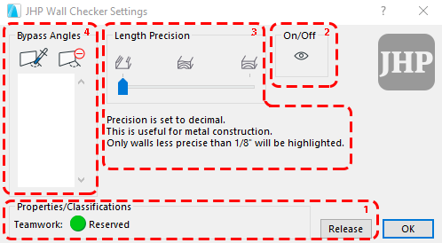
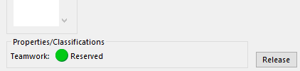
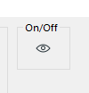
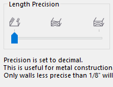
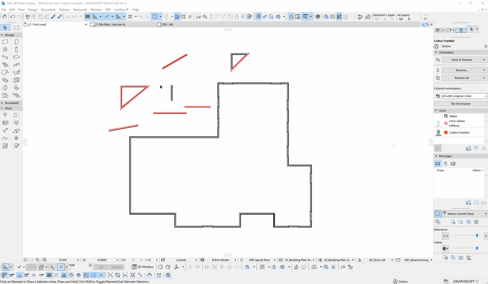
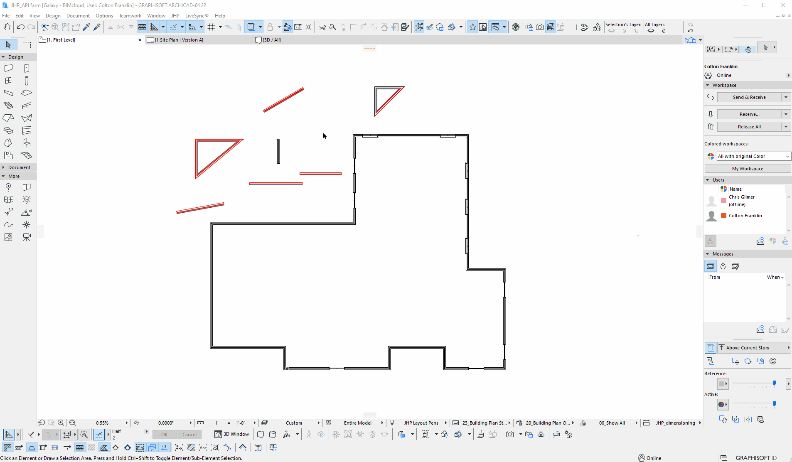
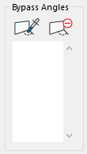
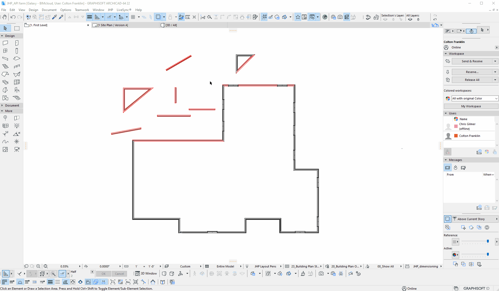
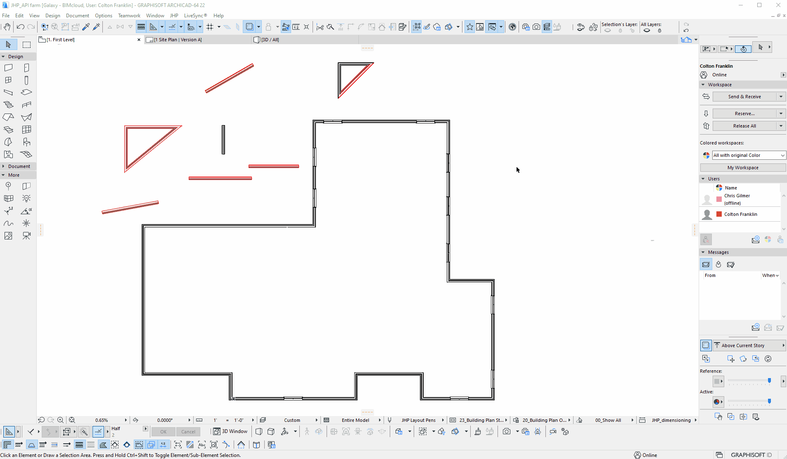

# [JHP Menu plugin](../README.md)
#### Documentation | Examples | Tutorials

## Wall Checker Usage

##### If you are looking for help with setting up the tool for the first time, see [Setup](SETUP.md).

The **Wall Checker** will highlight any walls that are drawn to non-ortho angles, or non-buildable dimensions. 
However, there are settings that can be adjusted to change the tolerance of the tool, or turn off the visual feedback entirely.

There are **4** main components of the settings dialog which will be documented through this guide, in order of importance.

1. **Properties/Classifications**
2. **On/Off**
3. **Length Precision**
4. **Bypass Angles**

---

#### *Please note that the tool accomplishes the visual feedback through **Graphic Overrides** applied to the *plan* related views. These overrides will most likely be visible in published PDFs. This is intentional, as reviews can be accomplished easily by publishing the drawing set and looking for highlighted errors. 

Due to this, it may be desireable near deadlines or for some users to turn off visual feedback when fixing the errors is not possible. 

---

#### Properties/Classifications

Changing any settings requires that the **Properties and Classifications** are reserved. Similar to the Archicad windows, the reservation status is displayed in the dialog box with the option to reserve or release, or in certain cases, display information about why reserving is not possible.

Note that the **Properties and Classifications** are the only requirement to change settings within the dialog. All changes will take effect after **OK** is pressed. Walls do **not** need to be reserved in order to change these settings.

---

#### On/Off

This control allows the user to turn off the visual feedback of errors. When the visual feedback is *off*, all other settings will be disabled. After turning *off* or *on* feedback, press okay or exit the window for changes to take effect.

#### * Please note that the On/Off setting, as with all settings, are __per project__ and not per user. Any settings changed here will apply to everyone on the project.

##### Example of turning off feedback:

---

#### Length Precision

This controls the precision of the checks and determines which walls are highlighted due to length errors. 

The text beneath the control is a description attempting to explain which walls will be highlighted, and will change based on which setting is selected.

- Left - **Decimal** precision
    - Highlights all walls that are beyond 1/8" precision.

- Middle - **Standard** precision
    - Highlights all walls that are beyond 1/8" precision.
    - Highlights all walls that are 1/8" precision.

- Right - **Fine** precision
    - Highlights all walls that are beyond 1/8" precision.
    - Highlights all walls that are 1/8" precision.
    - Highlights all walls that are 1/4" precision.

 

##### Examples of adjusting length precision:

---

#### Bypass Angles

This controls the angles that the checker will use to ignore error checking of walls. Walls that are at angles in this list will automatically pass the **angle** check, as well as be ignored in the **length** check.

There are two buttons for setting angles into the list. 

The **first** is designated by a **dropper** on a wall's angle. When this button is pressed, the settings dialog will close and the mouse cursor will change. This allows the user to select a wall, and add that wall's **angle** to the list of angles.

#### Example of adding a wall's angle to the Bypass Angles list:

#### *Please note that the angles described begin at 0 degrees to the right, move up to 90 degrees, and then reach 180 degrees to the left. The angle then decreases back to 90 degrees down, and then back to zero degrees to the right. 

#### This means angles never will appear above 180 degrees, and match the blue angle that is displayed when drawing a wall. This also means that if 45 degrees appears in the list, the equivalent 315 degrees is also covered.

#### *Please note that along with the wall's current angle, the *supplementary* angle is also added. This means that if a wall is 45 degrees, 135 degrees is also added. These two angles will cover all four instances of 45 degrees from 0.

The **second** button, designated by a red minus icon, will remove the currently selected angle from the list. Note that since the supplementary walls angles are added as well, both will need to be deleted if removing the angle is desired.

---

## This completes the current set of settings available for the wall checker.

[Click here to return to the home page.](../README.md)

#### Example of the visual feedback provided by the wall checker tool:

